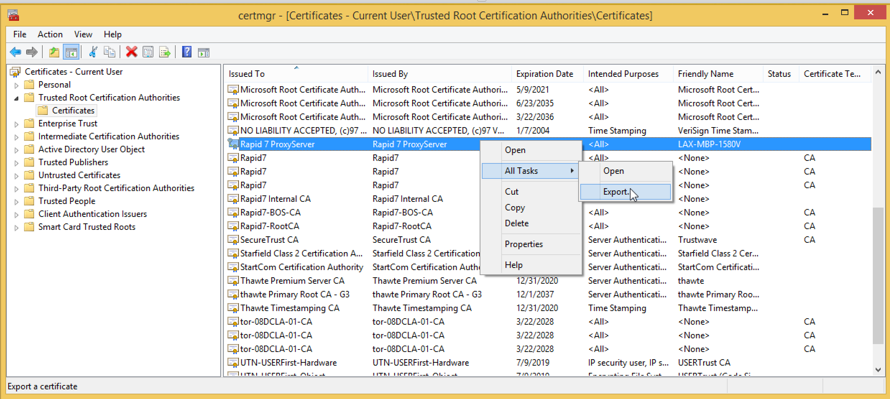
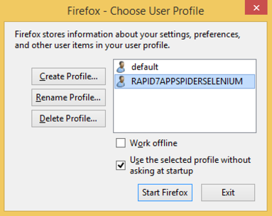
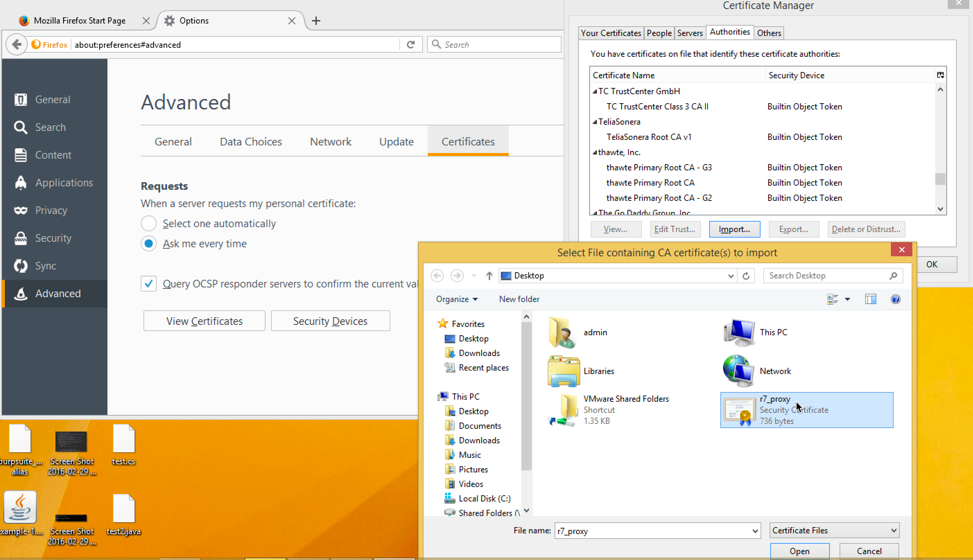
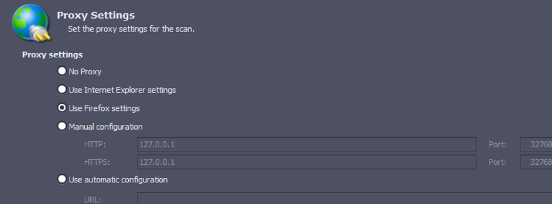
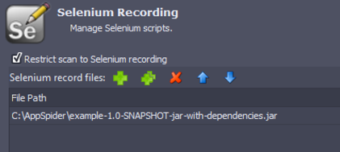

# selenium-java-firefox-appspider-example
selenium, java, firefox, SSL and Appspider example


dependencies
------------

* [>= java8](https://java.com/en/download/)
* [maven](https://maven.apache.org/download.cgi)
* [AppSpider](http://www.rapid7.com/products/appspider/)
* [Firefox](https://www.mozilla.org/en-US/firefox/new/)


building the example
------------

```
git clone https://github.com/sdavis-r7/selenium-java-firefox-appspider-example.git
cd selenium-java-firefox-appspider-example
mvn package

# the selenium script built is:
# target/example-1.0-SNAPSHOT-jar-with-dependencies.jar 
```

preparing firefox
-------------

* Export the AppSpider proxy certificate from Trusted Root System store using `certmgr`.



* Create new Firefox profile



* Import AppSpider certificate into new firefox profile



* Create an AppSpider run configuration with Proxy configured for firefox, and import the selenium jar built previously.





